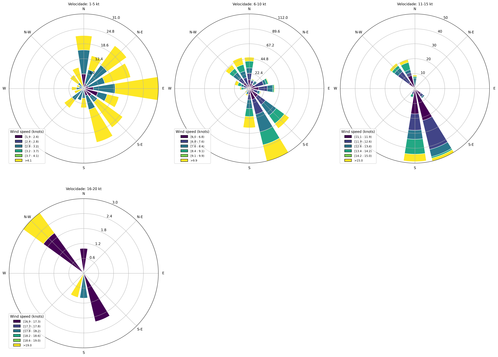

# Wind Rose Plot Generator

A powerful and user-friendly Streamlit application for generating detailed wind rose plots from meteorological data. This tool helps meteorologists, researchers, and aviation professionals visualize and analyze wind patterns through interactive and customizable wind rose diagrams.



## Features

- 📊 Generate comprehensive wind rose plots from CSV data
- 🎨 Create separate plots for different wind speed ranges
- 📥 Support for multiple CSV file uploads
- 💾 Download plots in high-resolution PNG format
- 🔄 Automatic unit conversion (m/s to knots)
- 📈 Interactive Streamlit interface

## Installation

1. Clone the repository:
```bash
git clone https://github.com/yourusername/weather-historical-aerodromes.git
cd weather-historical-aerodromes
```

2. Create a virtual environment (optional but recommended):
```bash
python -m venv venv
source venv/bin/activate  # On Windows, use: venv\Scripts\activate
```

3. Install the required dependencies:
```bash
pip install -r requirements.txt
```

## Usage

1. Start the Streamlit application:
```bash
streamlit run app.py
```

2. Open your web browser and navigate to the provided local URL (typically http://localhost:8501)

3. Upload your CSV file(s) containing wind data

4. Click "Generate Wind Rose Plots" to create the visualizations

## Input Data Format

The application expects CSV files with the following specifications:

- Separator: Semicolon (;)
- Decimal separator: Comma (,)
- Required columns:
  - Data (Date in DD/MM/YYYY format)
  - Hora (UTC) (Time in HHMM format)
  - wind_speed (Wind speed in m/s)
  - wind_dir (Wind direction in degrees)

Example of CSV format:
```
Data;Hora (UTC);temp;humidity;pressure;wind_speed;wind_dir;cloudiness;insolation;max_temp;min_temp;rainfall
01/01/2023;0000;25,5;80;1013,2;5,2;180;6;0;28,3;22,1;0,0
```

## Wind Rose Plot Types

The application generates two types of wind rose plots:

1. **Combined Plot**: Shows all wind speed ranges in a single figure with six subplots
2. **Individual Plots**: Separate plots for each wind speed range:
   - 1-5 knots
   - 6-10 knots
   - 11-15 knots
   - 16-20 knots
   - 21-30 knots
   - >30 knots

## Understanding the Plots

- **Direction**: The circular plot shows wind direction in degrees (0-360°)
- **Concentric Circles**: Represent the frequency (percentage) of observations
- **Color Bars**: Indicate wind speed ranges according to the legend
- **Legend**: Shows wind speed ranges in knots

## Dependencies

- Python 3.7+
- Streamlit
- Pandas
- NumPy
- Matplotlib
- Windrose

## Contributing

Contributions are welcome! Please feel free to submit a Pull Request.

## License

This project is licensed under the MIT License - see the [LICENSE](LICENSE) file for details.

## Acknowledgments

- Built with [Streamlit](https://streamlit.io/)
- Wind rose plots created using [Windrose](https://github.com/python-windrose/windrose) 